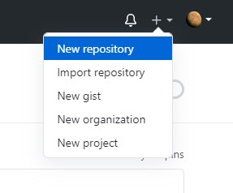
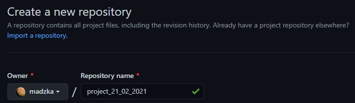
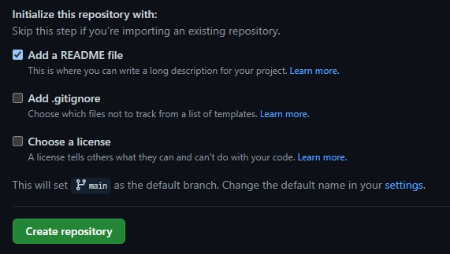

# **HOW TO CREATE A PRIVATE REPO** 

To put your project up on your GitHub Enterprise Server instance, you'll need to create a repository for it to live in. 

Go to https://github.com/ and log in to your account. 

In the upper-right corner click on + < plus sign > and create **New repository**. 

Type a name for your repository in **Repository name** box. 

Add a description of your repository if needed. 

Choose a repository visibility. Set **Priviate** to choose who can see and commit to this repository.

Select **Add a README file** and click on **Create repository**.  

You created your first repository and initialized it with a *README* file. 

