# **How to Download and Install Visual Studio Code on Windows**
Open web browser and go to https://code.visualstudio.com/. 
Click on the blue button **download** located on the right and select the operating system. 

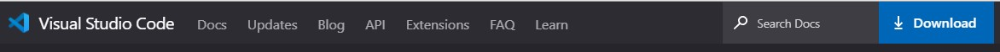 

Click on Windows to start download Visual Studio Code for Windows.

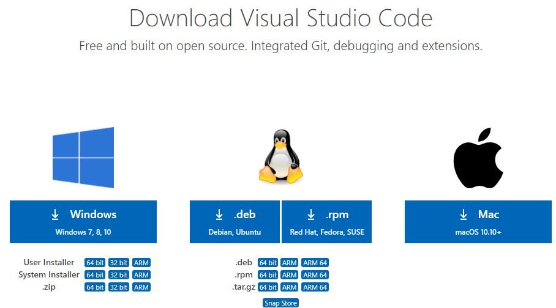 

Visual Studio Code downloads automatically. Once it is downloaded,
 run the installer *VSCodeUserSetup-x64-1.53.2.exe*. 
 
Select the language and click on **OK**.  

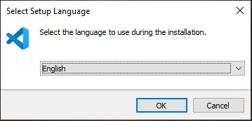

Accept the agreement and click on **Next**.

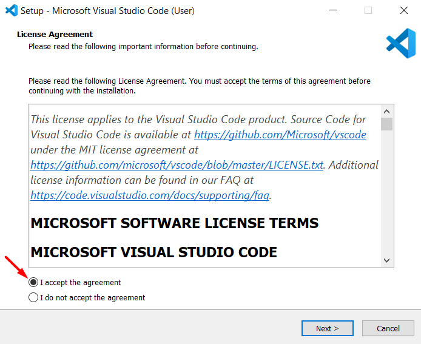 

Select Destination Location. 
 
 If you would like to select a different folder, click **Browser** and change location then click **Next**.

  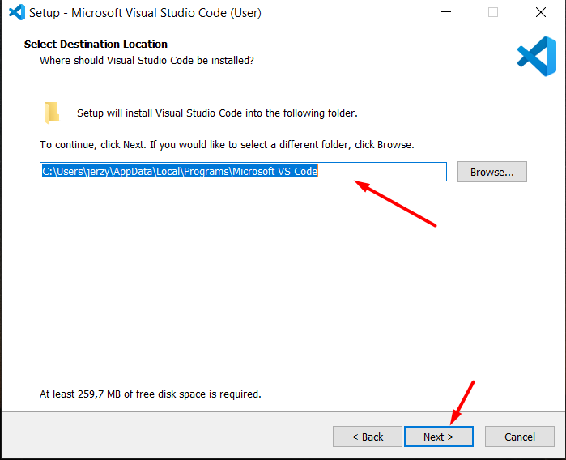

 In the following window, check **Add to PATH** and select **Create a desktop icon** so that it can be accessed from desktop and click on **Next**. 

  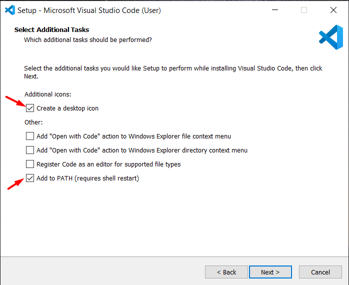

Click **Install** to continue with installation. 

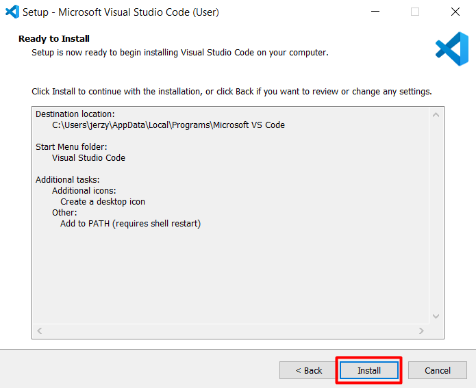

Finally, after installation completes, click on **Finish** button, and the Visual Studio Code gets open.

  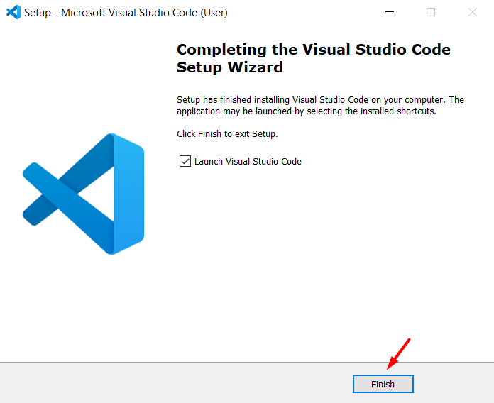

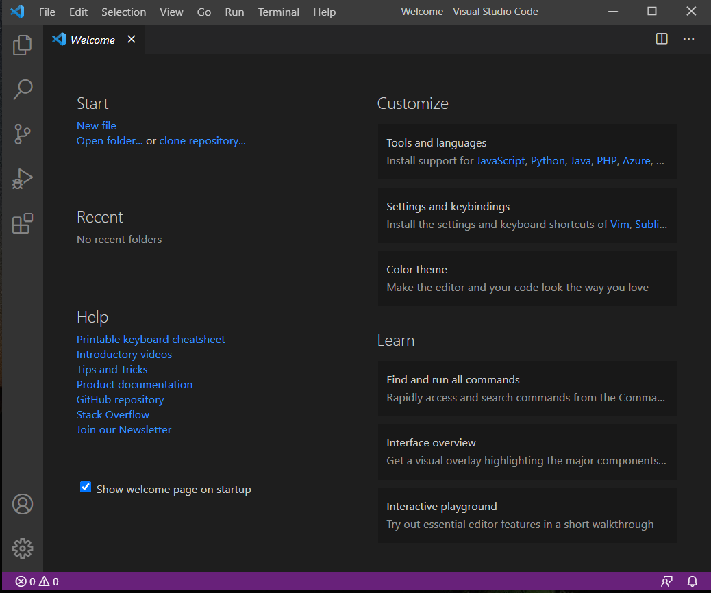

# **Visual Studio Code Extensions** 

## This part explains how to find, install, and manage Visual Studio Code extensions from the Visual Studio Code Marketplace.

You can browse and install extensions from within VS Code. Bring up the Extensions view by clicking on the **Extensions icon** in the Activity Bar on the side of Visual Studio Code.

To install extensions for Visual Studio Code click on **Extension icon** and you see search box **Search Extensions in Marketplace**. 

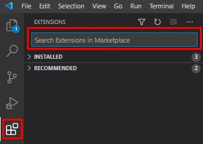

You can run various Extensions view commands by clicking on the **Filter Extensions icon**. The command shows the most popular extensions, recently published extensions, recommended extensions and others.  

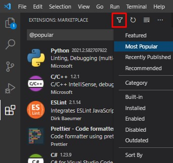

Find the extension you want to install. Select and click on **Install**. 

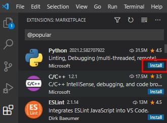

# Visual Studio Code - writing and preview options

To be more productive with Visual Studio Code you find keyboard reference sheet below. 

Reference Sheet Description is available on https://code.visualstudio.com/docs/getstarted/tips-and-tricks. 

The most useful options are: 

* Show Command Palette Ctrl+Shift+P
* Open Preview to the Side -> Ctrl+KV 
* Select View -> Render Whitespace
* Outline -> Shift+Ctrl+P @ breadbrumbs 
* Trigger Suggestion -> Ctrl+Space
* Formatting prompts -> Shift+Ctrl+P > Preferences: Configure Language Specific Settings > Markdown > "editor.suggest.showWords": false . 

